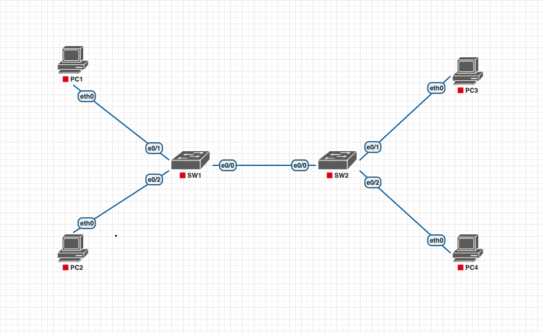

# Ethernet LAN Switching

Para esse laboratório, vamos utilizar como base o laboratório do nosso amigo, Jeremy, do canal Jeremy's IT Lab, ele usou o packet tracer.
Aproveita e já dá uma moral lá no [vídeo](https://www.youtube.com/watch?v=Ig0dSaOQDI8&list=PLxbwE86jKRgMpuZuLBivzlM8s2Dk5lXBQ&index=12) dele, maluco fez um curso completo, e gratuito, para o CCNA 200-301!

Eu uso o PNETLab, mas as imagens são compatíveis com o EVE-NG.

## Instruções

Para garantir que ambos os switches estão com a tabela de endereços MAC vazia, faça a limpeza dos endereços MAC aprendidos dinamicamente.
Todos os PCs estão com a tabela ARP vazia.

Os endereços IP dos PCs estão no arquivo do lab.

1. Se o PC1 der um ping no PC3, quais mensagens serão enviadas pela rede e quais dispositivos irão recebê-las?

2. Abra o 'wireshark', pode ser na interface ethernet 0/0 de qualquer um dos switches, e execute um ping do PC1 para o PC3 para verificar o tráfego fluindo.

3. Use pings para gerar tráfego na rede e permitir que os switches aprendam os endereços MAC de todos os PCs da rede.

4. Utilize comandos 'show' nos switches para identificar o endereço MAC de cada PC.

5. Limpe os endereços MAC dinâmicos da tabela de endereços MAC de cada switch.

6. Agora você pode repetir o procedimento para qualquer PC, desde que monitore a porta correta, ok?