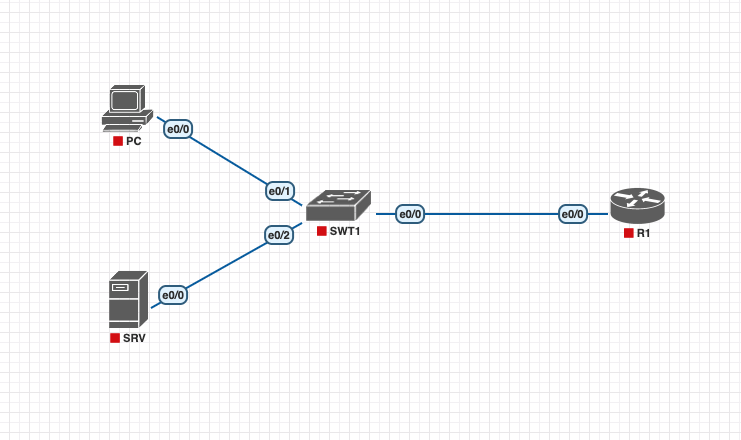

# Config Lab: CLI Passwords 1

## Requisitos do Laboratório

No blog do Wendell Odom, autor dos guias oficiais do CCNA, os labs foram criados com o Packet Tracer e o CML, aproveitando o embalo, segue o link para o lab original:

- [Config Lab: CLI Passwords 1](https://www.certskills.com/clab102/)

Configure a senha para acessar o switch SW1 via console e telnet. Também é necessário configurar uma senha para acessar o modo privilegiado. Configure as senhas para que todos os usuários utilizem a mesma senha para acessar o modo usuário a partir do console, sem necessidade de nome de usuário individual. Da mesma forma, use uma senha única para todos os usuários que acessarem o switch via Telnet para chegar ao modo usuário.

Este laboratório começa com todas as interfaces mostradas na Figura 1 funcionando, com endereços IPv4 configurados e com todos os hosts podendo pingar outros hosts locais e hosts no restante da empresa.

As regras específicas para este laboratório são as seguintes:

1. Habilite o uso para a utilização da base de dados local para realizar o login através da Console ou Telnet.
2. Crie um usuário: Senha "hope" para o usuário "allison".
3. Crie um usuário: Senha "love" para o usuário "danielle".
4. Crie um usuário: Senha "faith" para o usuário "tyler".

**Topologia Original**


**Topologia EVE/PNETLAB**


### Configuração Inicial

Abaixo, podemos observar a configuração aplicada ao switch SW1 antes do início do seu trabalho neste laboratório. Basicamente, o switch já foi configurado com um endereço IP e um gateway padrão para permitir o acesso via telnet.

```cisco
 hostname SW1
ip route 0.0.0.0 0.0.0.0 10.1.1.1
!
interface vlan1
 ip address 10.1.1.20 255.255.255.0
```

### Configuração do Lab CLI Passwords 1

Para responder, basta pensar sobre o laboratório. Consulte seu material de estudo principal para o CCNA, suas anotações, e aplique a configuração no [arquivo inicial do lab](./assets/lab/16_config_lab_cli_passwords_1_inicial.zip). Depois, confira sua resposta com as [instruções para a solução do lab](./lab-solution.md) e o [lab solucionado](./assets/lab/16_config_lab_cli_passwords_1_resolvido).

| Device | IP Address|
| --- | --- |
| PC | 10.1.1.11 |
| SRV | 10.1.1.22 |
