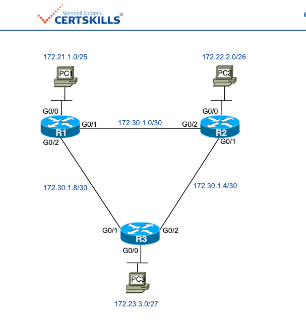
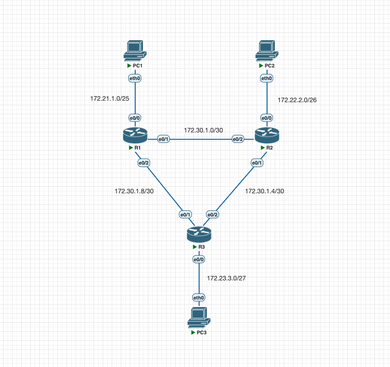

# Config Lab: CLI Exploration

Configure o OSPF para a rede do laboratório demonstrada na topologia. No entanto, não utilize a configuração tradicional com comandos network no modo de configuração do OSPF. Em vez disso, use a configuração de interface OSPF.

**Essa é uma adaptação do lab que pode ser encontrado no link:** [CertSkills](https://www.certskills.com/clab519/#1621529957863-520a29fa-582d)



## Requisitos do Laboratório

As regras específicas para este laboratório são:

1. Configure para que cada roteador use um router-id de x.x.x.x onde x é igual ao número do roteador.
2. Não dependa dos endereços IP da interface para a definição dos router-IDs.
3. Use a área 0 do OSPF para todas as interfaces.
4. Habilite o OSPF diretamente em cada interface, em vez de usar o método indireto e o comando network do OSPF.

> Assuma que todas as interfaces mostradas no laboratório estão ativas (up) e funcionando.

## Configuração Inicial



As configurações abaixo mostram o estado inicial de R1, R2 e R3.

R1

```cisco
hostname R1
!
interface ethernet0/0
 no shutdown
 ip address 172.21.1.1 255.255.255.128
!
interface ethernet0/1
 no shutdown
 ip address 172.30.1.1 255.255.255.252
!
interface ethernet0/2
 no shutdown
 ip address 172.30.1.10 255.255.255.252
```

R2

```cisco
hostname R2
!
interface ethernet0/0
 no shutdown
 ip address 172.22.2.2 255.255.255.192
!
interface ethernet0/1
 no shutdown
 ip address 172.30.1.5 255.255.255.252
!
interface ethernet0/2
 no shutdown
 ip address 172.30.1.2 255.255.255.252
```

R3

```cisco
hostname R3
!
interface ethernet0/0
 no shutdown
 ip address 172.23.3.3 255.255.255.224
!
interface ethernet0/1
 no shutdown
 ip address 172.30.1.9 255.255.255.252
!
interface ethernet0/2
 no shutdown
 ip address 172.30.1.6 255.255.255.252
```

## Arquivos

- [Arquivo inicial do laboratório](./assets/lab/config_lab_ospf_interface_config_1_inicial.zip)
- [Arquivo do laboratório resolvido](./assets/lab/config_lab_ospf_interface_config_1_resolvido.zip)
