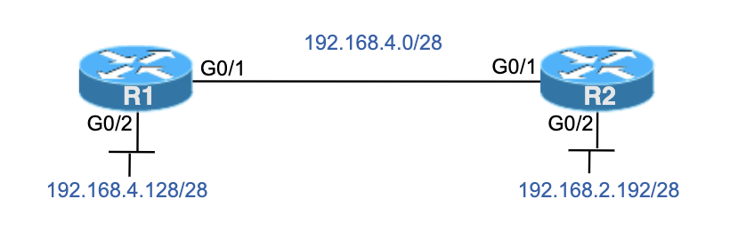

# Config Lab: OSPF Network Config 1

Configure o OSPF legado (tradicional) (usando comandos network) entre R1 e R2

**Essa é uma adaptação do lab que pode ser encontrado no link:** [CertSkills](https://www.certskills.com/clab521/#1621532681263-db181298-6349)



## Requisitos do Laboratório

Este laboratório apresenta dois conjuntos de requisitos. Ambos usam as seguintes regras:

1. Configure cada roteador com um router-id de x.x.x.x onde x é igual ao número do roteador.
2. Use a área 0 (zero) do OSPF.
3. Use o número 20 como process-id (ID de processo) do OSPF.
4. Forneça uma resposta completa tanto para o cenário 1 quanto para o cenário 2, conforme a seguir:
    - Cenário 1: Cada comando network deve corresponder apenas a redes classful (redes com classe), isto é, corresponder a redes classe A, B e C.
    - Cenário 2: Cada comando network deve corresponder às sub-redes das interfaces do roteador.

## Configuração Inicial


As configurações abaixo mostram o estado inicial de R1 e R2.

R1

```cisco
hostname R1
!
interface GigabitEthernet0/1
 no shutdown
 ip address 192.168.4.1 255.255.255.240
!
interface GigabitEthernet0/2
 no shutdown
 ip address 192.168.4.129 255.255.255.240
```

R2

```cisco
hostname R2
!
interface GigabitEthernet0/1
 no shutdown
 ip address 192.168.4.2 255.255.255.240
!
interface GigabitEthernet0/2
 no shutdown
 ip address 192.168.2.193 255.255.255.240
 ```

## Arquivos Cenário 1

- [Arquivo inicial do laboratório](./assets/lab/config_lab_ospf_network_config_1_cenario-1_inicial.zip)
- [Arquivo do laboratório resolvido](./assets/lab/config_lab_ospf_network_config_1_cenario-1_resolvido.zip)

## Arquivos Cenário 2

- [Arquivo inicial do laboratório](./assets/lab/config_lab_ospf_network_config_1_cenario-2_inicial.zip)
- [Arquivo do laboratório resolvido](./assets/lab/config_lab_ospf_network_config_1_cenario-2_resolvido.zip)