# Labs CCNA – Repositório de Prática

Este repositório reúne laboratórios práticos que utilizo para estudar e revisar os tópicos exigidos na certificação Cisco CCNA. A ideia é centralizar materiais de diferentes fontes confiáveis em um único lugar, oferecendo opções variadas para praticar habilidades de switching, routing e serviços de rede.

## Servidor do Discord

Também criei um servidor no discord, para quem quiser participar ou ajudar: [NetworkLabs](https://discord.gg/VTpuvYmp)

## Fontes dos Laboratórios

- **[CertSkills](https://www.certskills.com)**
- **[Packet Tracer Network](https://www.packettracernetwork.com)**
- **[Jeremy's IT Lab](https://www.jeremysitlab.com)**
- **[Workshops do Gustavo Kalau](https://www.youtube.com/@GustavoKalau/playlists)**

Observação: Este repositório organiza e referencia materiais para estudo. Respeite as licenças/termos de uso originais dos autores e cursos.

## Estrutura do Repositório

Os laboratórios estão organizados por temas para facilitar o estudo. Cada diretório de laboratório contém:

- `instructions.md`: roteiro do laboratório e objetivos.
- `lab-solution.md`: referência de solução.
- `assets/`: imagens de topologia, capturas de tela e arquivos `.zip` com as topologias (quando aplicável).

### 📁 Organização por Temas

#### `cli-basics/` - Fundamentos de CLI

Configurações básicas de switches e roteadores, segurança de acesso CLI, SSH/Telnet, e exploração de comandos.

- `01_basic-switch-configuration/`
- `02_basic-switch-setup/`
- `03_basic-router-setup/`
- `04_config-lab_cli-passwords-1/`
- `05_config-lab_cli-passwords-2/`
- `06_config-lab_enabling-ssh-and-disabling-telnet/`
- `07_config-lab_switch-ip-1/`
- `08_config-lab_login-security-1/`
- `09_config-lab_cli-miscellany-1/`
- `10_config-lab_switch-duplex-and-speed/`
- `11_config-lab_switch-admin-config/`
- `12_config-lab_switch-ip-config/`
- `13_config-lab_cli-exploration-1/`
- `14_config-lab_cli-exploration-2/`
- `15_config-lab_telnet-config/`
- `16_config-lab_ssh-config/`

#### `switching-layer2/` - Switching e Protocolos de Camada 2

VLANs, trunking, STP/RSTP, VTP, EtherChannel (L2 e L3), e troubleshooting de switching.

- `01_ethernet-lan-switching/`
- `02_configuring-switch-interfaces/`
- `03_vlan-and-vtp-configuration/`
- `04_lan-switching-troubleshooting/`
- `05_config-lab_vlan-basics-3/`
- `06_config-lab_data-and-voice-vlan-1/`
- `07_config-lab_data-and-voice-vlan-2/`
- `08_config-lab_trunking-puzzle-1/`
- `09_config-lab_basic-vlans/`
- `10_config-lab_trunking-for-only-some-vlans/`
- `11_config-lab_rstp-config-1/`
- `12_config-lab_rstp-config-2/`
- `13_config-lab_l2-etherchannel-1/`
- `14_config-lab_l2-etherchannel-2/`
- `15_config-lab_big-vlan-and-stp-lab-1/`
- `16_config-lab_roas-basics-1/`
- `17_config-lab_layer3-switching-1/`
- `18_config-lab_layer3-switching-2/`
- `19_config-lab_layer3-switching-with-svis/`
- `20_config-lab_layer3-switching-with-routed-ports/`
- `21_config-lab_l3-etherchannel-1/`

#### `static-routing/` - Roteamento Estático

Configuração de rotas estáticas IPv4 e IPv6, e troubleshooting de roteamento.

- `01_static-routes/`
- `02_ip-routing-troubleshooting/`
- `03_config-lab_ipv4-static-routes-1/`
- `04_config-lab_ipv4-static-routes-2/`
- `05_config-lab_ipv4-static-routes-3/`
- `06_config-lab_ipv6-static-routes-1/`
- `07_config-lab_ipv6-static-routes-2/`

#### `dynamic-routing/` - Roteamento Dinâmico

Configuração e otimização de protocolos de roteamento dinâmico como OSPF e RIP.

- `01_rip-v2/`
- `02_config-lab_ospf-interface-config-1/`
- `03_config-lab_ospf-interface-config-2/`
- `04_config-lab_ospf-network-config-1/`
- `05_config-lab_ospf-network-config-2/`
- `06_config-lab_ospf-multi-area-ospf-1/`
- `07_config-lab_ospf-multi-area-ospf-2/`
- `08_config-lab_ospf-dr-priority/`
- `09_config-lab_ospf-network-type/`
- `10_config-lab_ospf-router-ids/`
- `11_config-lab_ospf-metrics/`

#### `basic-security/` - Segurança Básica

ACLs (padrão e estendidas), Port Security, DHCP Snooping, DAI e outras técnicas de segurança de camada 2.

- `01_port-security/`
- `02_config-lab_standard-numbered-acl-1/`
- `03_config-lab_standard-named-acl-1/`
- `04_config-lab_extended-numbered-acl-1/`
- `05_config-lab_extended-named-acl-1/`
- `06_config-lab_basic-port-security-1/`
- `07_config-lab_basic-port-security-2/`
- `08_config-lab_basic-port-security-3/`
- `09_config-lab_basic-port-security-4/`
- `10_config-lab_dhcp-snooping-1/`
- `11_config-lab_dhcp-snooping-2/`
- `12_config-lab_dai-1/`

#### `ip-services/` - Serviços IP

Endereçamento IPv4/IPv6, DHCP, NAT/PAT, links seriais (HDLC, PPP, Frame Relay), NTP, Syslog, e protocolos de descoberta (CDP/LLDP).

- `01_configuring-serial-links/`
- `02_hdlc/`
- `03_ppp/`
- `04_frame-relay/`
- `05_config-lab_ipv4-addressess-1/`
- `06_config-lab_ipv4-addressess-2/`
- `07_config-lab_ipv4-addressess-3/`
- `08_config-lab_ipv4-addressess-4/`
- `09_config-lab_ipv4-addressess-5/`
- `10_config-lab_dhcp-relay/`
- `11_config-lab_router-as-dhcp-client/`
- `12_config-lab_ipv6-eui64-addressing-1/`
- `13_config-lab_ipv6-global-unicast-addressing-1/`
- `14_config-lab_ipv6-special-addresses-1/`
- `15_config-lab_ipv6-special-addresses-2/`
- `16_config-lab_cdp-lldp-1/`
- `17_config-lab_ntp-client-and-server/`
- `18_config-lab_syslog-1/`
- `19_config-lab_syslog-2/`
- `20_config-lab_syslog-3/`
- `21_config-lab_dynamic-nat-1/`
- `22_config-lab_static-nat-1/`
- `23_config-lab_interface-pat-1/`
- `24_config-lab_pat-with-a-pool-1/`

## Pré-requisitos

- PNETLab ou EVE-NG
- Conhecimentos básicos de CLI Cisco IOS.

## Como Usar

1. Clone o repositório.
2. Navegue até o tema desejado (ex.: `cli-basics/`, `switching-layer2/`, etc.).
3. Escolha um diretório de lab (ex.: `cli-basics/02_basic-switch-setup/`).
4. Leia o `instructions.md` para entender objetivos e passos.
5. Abra a topologia correspondente na ferramenta (geralmente arquivos em `assets/lab/` → `.zip` contendo `.unl`).
6. Execute as configurações conforme o roteiro.
7. Compare seu resultado com o `lab-solution.md` e ajuste o que for necessário.

Exemplo de clonagem:

```bash
git clone https://github.com/bl4cktux89/labs-ccna.git
cd labs-ccna
```

### Importando um Lab no PNETLab/EVE-NG

Para importar um lab, você deve baixar o arquivo `.zip` dentro da pasta do lab desejado. Após realizar o download, você deve acessar o seu PNETLab (o processo é muito semelhante no EVE-NG):

1. Na tela inicial, clique em 'Import' conforme o exemplo abaixo:
    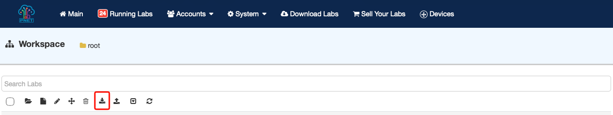

2. Selecione o arquivo e clique em 'Upload':
    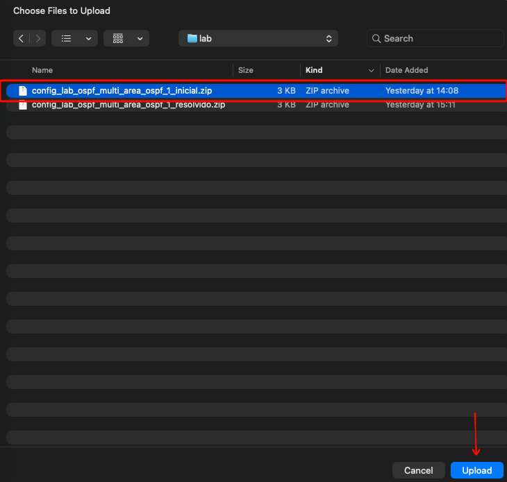

3. Clique em 'Upload' na coluna 'Actions':
    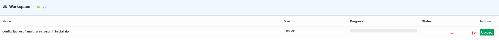

4. Ao final do processo, você verá uma mensagem de sucesso:
    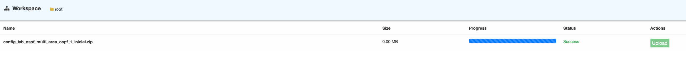

5. Na lista de labs, aparecerá o lab que você fez o upload:
    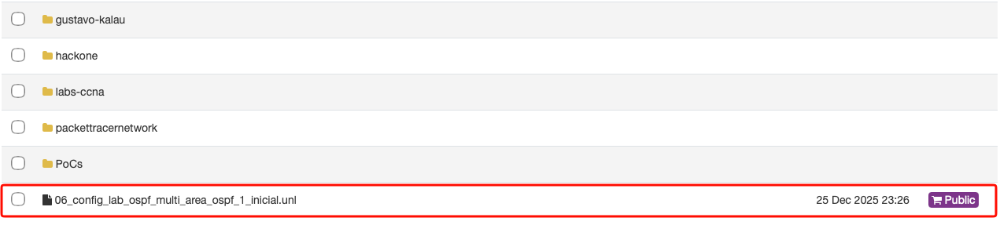

6. Clique no lab e depois em 'Open':
    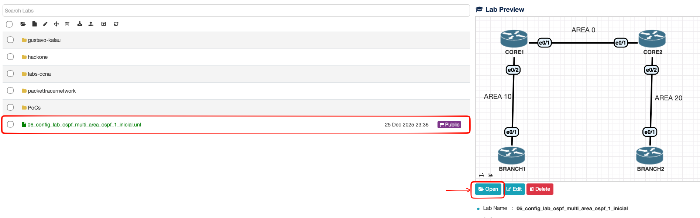

7. Antes de iniciar os equipamentos, você deve fazer os procedimentos abaixo, para que os equipamentos iniciem com as configurações que deixei prontas previamente. Naquele ícone do lado esquerdo, apenas passe o mouse que irá abrir um menu de opções:
    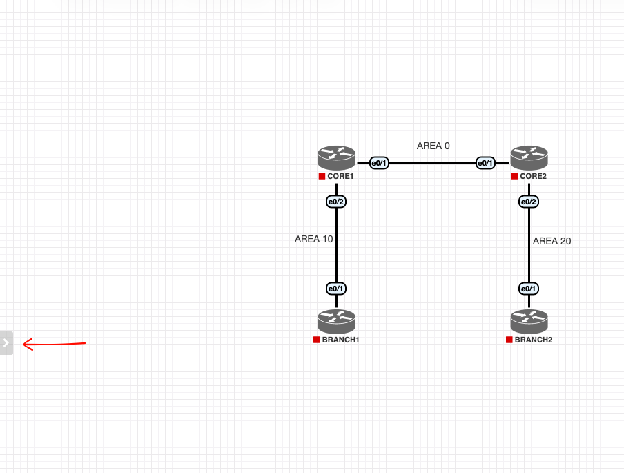

8. Ao abrir o menu, clique em 'Setup Nodes':
    

9. Clique em 'Wipe All Nodes' para limpar todas as configurações dos equipamentos:
    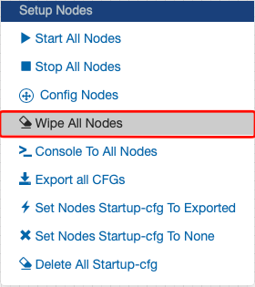

10. Confirme que deseja limpar as configurações clicando em 'Yes':
    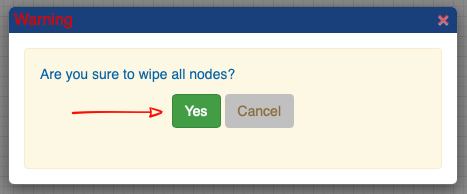

11. Observe nas notificações ao lado direito que os nodes foram limpos:
    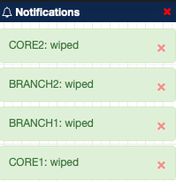

12. Abra novamente o menu de opções, depois em 'Setup Nodes' e na sequência clique em 'Set Nodes Startup-cfg To Exported':
    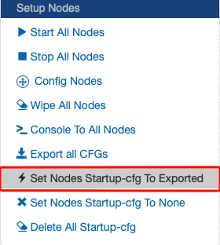

13. Observe nas notificações que após o boot, os equipamentos irão iniciar com as configurações que foram aplicadas previamente:
    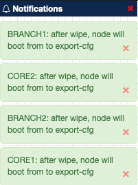

14. Agora finalmente iremos iniciar os equipamentos. Para isso, você pode fazer individualmente ou ligar todos de uma vez. Para ligar todos de uma vez, será necessário abrir o menu de opções novamente, clicar em 'Setup Nodes' e depois clicar em 'Start All Nodes':
    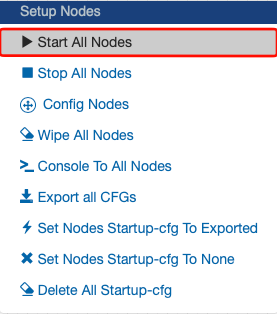

15. Observe que ao aparecer o ícone de 'Play', poderemos acessar os equipamentos:
    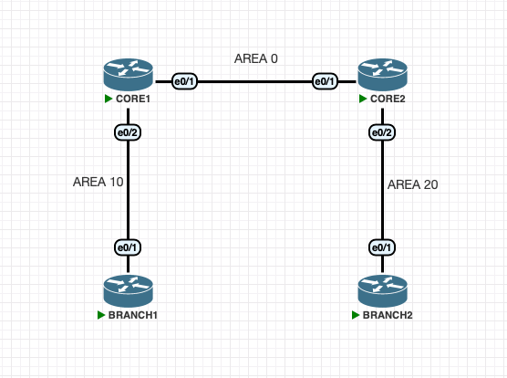

16. Clique em um dos equipamentos para confirmar que ele já tem configuração aplicada, pois já deve estar com hostname:
    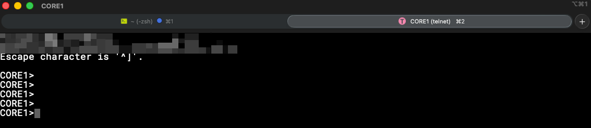

Para realizar a confirmação das configurações, pode variar de lab para lab, mas com os comandos abaixo já deve ser suficiente:

```cisco
enable
show running-config
```

## Boas Práticas de Estudo

- **Refaça**
- **Varie**
- **Documente**

## Roadmap (ideias futuras)

- Incluir checklists de verificação (show commands) por tópico.
- Adicionar mais laboratórios de troubleshooting avançado.

## Contribuição

Sugestões e correções são bem-vindas. Abra uma Issue ou envie um Pull Request com:

- Descrição clara do problema/melhoria.
- Prints/topologias se aplicável.
- Referências (quando derivado de conteúdo de terceiros).

## Licença

Consulte o arquivo `LICENSE` para detalhes. Materiais de terceiros citados/organizados aqui permanecem sob suas respectivas licenças.
