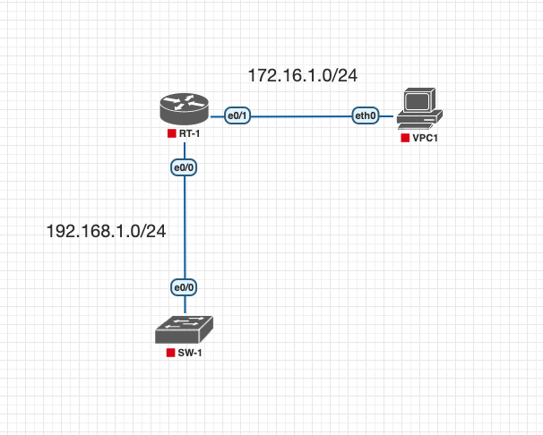

# Configuração Básica de Switch

## **Instruções do Laboratório**

Este laboratório testará sua capacidade de configurar definições básicas como **hostname**, **banner motd**, **senhas de acesso** e **opções de terminal** em um switch Cisco emulado em uma imagem IOL no PNETLAB, ou EVE-NG.

**Essa é uma adaptação do lab que pode ser encontrado no link:** [Packet Tracer Network](https://www.packettracernetwork.com/labs/lab1-basicswitchsetup.html)

1. Conecte-se à console do switch (duplo clique no equipamento) e configure o **hostname** como `sw-1`.

2. Configure a mensagem do dia (**message of the day**) como `"O acesso é proibido a pessoas não autorizadas!"`.

3. Configure a senha para o acesso ao modo privilegiado como `"cisco"`. A senha deve ser em texto plano.

    - Verifique as configurações atuais do equipamento.
    - **O que foi observado nas configurações de senha para o acesso ao modo privilegiado?**

4. Configure o acesso via **CONSOLE** com as seguintes definições:
    - Senha: `console`
    - Tamanho do histórico (**History size**): 15 comandos
    - Tempo limite (**Timeout**): 6 minutos e 45 segundos
    - Synchronous logging

5. Configure o acesso via **TELNET** com as seguintes definições:
    - Senha: `telnet`
    - Tamanho do histórico (**History size**): 15 comandos
    - Tempo limite (**Timeout**): 8 minutos e 20 segundos
    - Synchronous logging

6. Configure o endereço IP da SVI (VLAN 1) do switch como `192.168.1.2/24` e seu gateway padrão (**default gateway**) como `192.168.1.1`.

7. Utilizando o WireShark, monitore a porta do switch que está conectada ao roteador.

8. Teste a conectividade Telnet a partir do VPC1 usando a CLI.
    - Observe o tráfego referente ao protocolo telnet
    - Aplique alguns comandos para observar melhor o comportamento do protocolo

9. Configure o serviço de criptografia de senhas no switch.
    - Verifique as configurações atuais do equipamento
    - **O que foi observado e quais são os problemas dessa configuração?**

10. Configure a senha para o acesso ao modo privilegiado como `"c15c0"`. A senha deve ser criptografada com **MD5**.
    - Acesse o modo privilegiado e responda aos questionamentos abaixo
    - **Qual foi a senha que foi aceita ao acessar o equipamento?**
    - **Você consegue explicar o que aconteceu para o equipamento aceitar essa senha?**

11. Altere o acesso via **CONSOLE** dos as seguintes definições:
    - Usuário: `console`
    - Senha: `c0ns0l3`

12. Configure o acesso via **SSH** com as seguintes definições:
    - Usuário: `ssh`
    - Senha: `s3cur3sh3ll`

13. Observe o comportamento do tráfego referente ao protocolo SSH e compare com o tráfego referente ao protocolo Telnet.

    - **Poderia explicar, de forma simples e sucinta, a diferença no funcionamento dos protocolos?**
