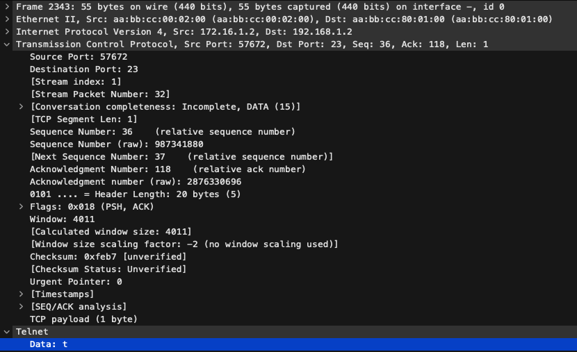
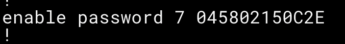

# Configuração Básica de Switch


## Solução do LAB

1. 

```cisco
enable
configure terminal
hostname sw-1
```

Como o prompt deve ficar após a configuração ser aplicada:

```cisco
sw-1(config)#
```

2. 

```cisco
banner motd # O acesso e proibido a pessoas nao autorizadas! #
```


3. 

```cisco
enable password cisco
```

```cisco
show running-config
```


4. 

```cisco
line console 0
password console
login
history size 15
exec-timeout 6 45
logging synchronous
```

5. 

```cisco
line vty 0 4
password telnet
login
transport input telnet
history size 15
exec-timeout 8 20
logging synchronous
```

6.

```cisco
interface vlan 1
ip address 192.168.1.2 255.255.255.0
no shutdown
```

```cisco
ip route 0.0.0.0 0.0.0.0 192.168.1.1
```

7. 


8. 





9. 

```cisco
service password-encryption
show running-config
```



10.

```cisco
enable secret c15c0
```


11.

```cisco
username console secret c0ns0l3
```

12.

```cisco
username ssh secret s3cur3sh3ll
```

13. 

```cisco
ip domain-name example.dev
```

> Se atentar ao gerar as chaves, para que atendam ao SSH v2, o tamanho da chave RSA precisa de pelo menos 768 bits para atender a essa condição

```cisco
crypto key generate rsa
```
Prompt que irá aparecer:

```cisco
The name for the keys will be: RT-1.example.dev
Choose the size of the key modulus in the range of 360 to 4096 for your
  General Purpose Keys. Choosing a key modulus greater than 512 may take
  a few minutes.

How many bits in the modulus [512]: ( Inserir valor igual ou maior que 768)
```

```cisco
ip ssh version 2
```

Acesse as configurações da console e dos terminais remotos:

```cisco
line console 0
no password
login local
```

```cisco
line vty 0 4
no password
login local
```
