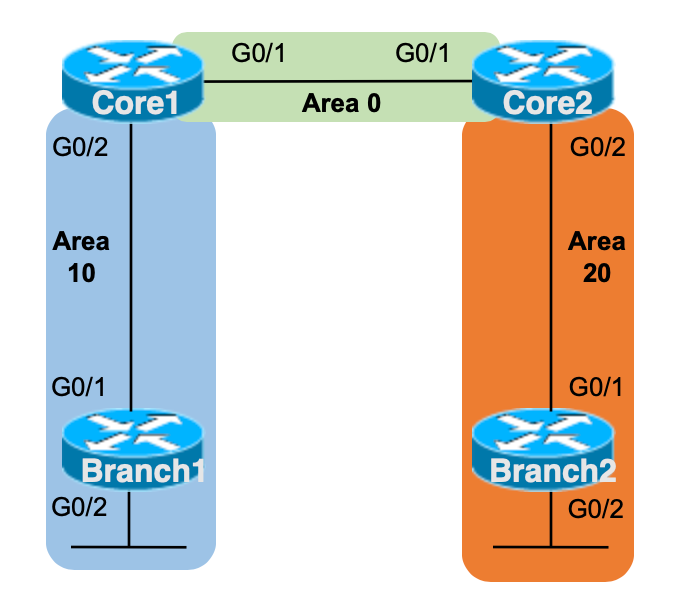

# Config Lab: OSPF Multi-área 1

**Essa é uma adaptação do lab que pode ser encontrado no link:** [CertSkills](https://www.certskills.com/clab551/)



Ao usar o comando network do OSPF, seja em área única ou multi-área, é preciso ter cuidado com a máscara wildcard utilizada e quais interfaces cada comando network corresponde. Com múltiplas áreas, essa preocupação aumenta, pois uma correspondência incorreta pode colocar uma interface do roteador na área errada. Este laboratório de OSPF oferece um pequeno design OSPF multi-área e pede para você habilitar OSPFv2 com comandos network, para praticar especificamente esses comandos.

## Requisitos do Laboratório

Configure OSPFv2 multi-área (ou seja, OSPF para IPv4) nos quatro roteadores mostrados na figura. Use o design de áreas mostrado na figura. A configuração deve usar comandos network do OSPF e não usar o subcomando ip ospf de interface. As regras específicas para este laboratório são:

- Use o process-ID OSPF 10 em todos os roteadores
- Use apenas o comando network para habilitar OSPF nas interfaces
- Use um comando network para cada interface do roteador mostrada na figura. Esse comando network deve usar uma máscara wildcard que corresponda a todos os endereços IP na sub-rede conectada à interface. (Nota: Adicionei esta regra no laboratório apenas para que haja uma maneira correta de responder este lab; na vida real muitas máscaras wildcard diferentes podem ser usadas.)
- Configure router-ID's explicitamente no modo de configuração OSPF, com router ID's conforme a seguir:
  - Core1: 1.1.1.1
  - Core2: 2.2.2.2
  - Branch1: 10.10.10.10
  - Branch2: 20.20.20.20
- Use todos os parâmetros padrão do OSPF, a menos que solicitado de outra forma
- Assuma que todas as interfaces dos dispositivos mostradas no laboratório estão ativas, funcionando e com endereços IP corretos atribuídos

## Configuração Inicial


- CORE1:

```cisco
hostname CORE1
!
interface Ethernet0/1
 ip address 100.100.100.1 255.255.255.252
 no shutdown
!
interface Loopback0
 ip address 1.1.1.1 255.255.255.255
 no shutdown
!
interface Ethernet0/2
 ip address 100.100.100.129 255.255.255.192
 no shutdown
```

- CORE2:

```cisco
hostname CORE2
!
interface Ethernet0/1
 ip address 100.100.100.2 255.255.255.252
 no shutdown
!
interface Loopback0
 ip address 2.2.2.2 255.255.255.255
 no shutdown
!
interface Ethernet0/2
 ip address 100.100.100.193 255.255.255.192
 no shutdown
```

- BRANCH1:

```cisco
hostname BRANCH1
!
interface Ethernet0/1
 ip address 100.100.100.130 255.255.255.192
 no shutdown
!
interface Loopback0
 ip address 10.10.10.10 255.255.255.255
 no shutdown
!
interface Loopback1
 ip address 100.100.101.126 255.255.255.128
 no shutdown
```

- BRANCH2:

```cisco
hostname BRANCH2
!
interface Ethernet0/1
 ip address 100.100.100.194 255.255.255.192
 no shutdown
!
interface Loopback0
 ip address 20.20.20.20 255.255.255.255
 no shutdown
!
interface Loopback1
 ip address 100.100.101.254 255.255.255.128
 no shutdown
```

## Arquivos

- [Arquivo inicial do laboratório](./assets/lab/config_lab_ospf_multi_area_1_inicial.zip)
- [Arquivo do laboratório resolvido](./assets/lab/config_lab_ospf_multi_area_1_resolvido.zip)