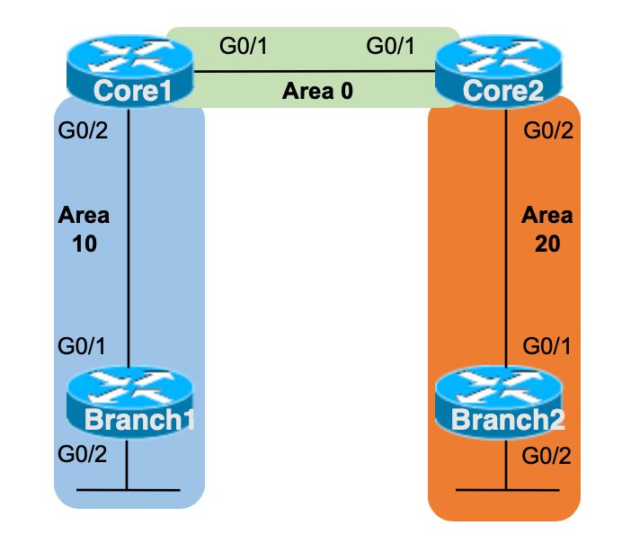

# Config Lab: OSPF Multi-área 2

**Essa é uma adaptação do lab que pode ser encontrado no link:** [CertSkills](https://www.certskills.com/clab552/)



Uma configuração de roteador pode habilitar OSPF em uma interface diretamente usando o subcomando ip ospf de interface. Na verdade, a configuração é mais direta e óbvia do que o uso tradicional antigo do subcomando network do OSPF. Este laboratório combina a configuração de interface OSPF com um design OSPF multi-área, com um pouco de configuração extra relacionada a router IDs do OSPF adicionada para variedade.

## Requisitos do Laboratório

Configure OSPFv2 multi-área (ou seja, OSPF para IPv4) nos quatro roteadores mostrados na figura. Use o design de áreas mostrado na figura. A configuração deve usar o subcomando ip ospf de interface para habilitar OSPF em cada interface, e não deve usar comandos network no modo de configuração OSPF. As regras específicas para este laboratório são:

- Use o process-ID OSPF 50 em todos os roteadores
- Use apenas subcomandos ip ospf de interface para habilitar OSPF em uma interface
- Use os seguintes router IDs OSPF e faça cada roteador usar o método listado abaixo quando o roteador escolher seu router ID:
  - Core1: 1.1.1.1 (configurado explicitamente)
  - Core2: 2.2.2.2 (configurado explicitamente)
  - Branch1: 172.30.99.1 (Baseado no endereço da interface loopback0 de 172.30.99.1/32)
  - Branch2: 172.30.99.2 (Baseado no endereço da interface loopback0 de 172.30.99.2/32)
- Use todos os parâmetros padrão do OSPF, a menos que solicitado de outra forma
- Assuma que todas as interfaces dos dispositivos mostradas no laboratório estão ativas, funcionando e com endereços IP corretos atribuídos

## Configuração Inicial


- CORE1:

```cisco
hostname CORE1
!
interface Ethernet0/1
 ip address 172.30.1.129 255.255.255.252
 no shutdown
!
interface Ethernet0/2
 ip address 172.30.1.193 255.255.255.248
 no shutdown
!
interface Loopback 0
 ip address 1.1.1.1 255.255.255.255
 no shutdown
```

- CORE2:

```cisco
hostname CORE2
!
interface Ethernet0/1
 ip address 172.30.1.130 255.255.255.252
 no shutdown
!
interface Ethernet0/2
 ip address 172.30.1.201 255.255.255.248
 no shutdown
!
interface Loopback 0
 ip address 2.2.2.2 255.255.255.255
 no shutdown
```

- BRANCH1:

```cisco
hostname BRANCH1
!
interface Ethernet0/1
 ip address 172.30.1.194 255.255.255.248
 no shutdown
!
interface Loopback 0
 ip address 172.30.99.1 255.255.255.255
 no shutdown
!
interface Loopback 1
 ip address 172.30.1.1 255.255.255.192
 no shutdown
```

- BRANCH2:

```cisco
hostname BRANCH2
!
interface Ethernet0/1
 ip address 172.30.1.202 255.255.255.248
 no shutdown
!
interface Loopback 0
 ip address 172.30.99.2 255.255.255.255
 no shutdown
!
interface Loopback 1
 ip address 172.30.1.65 255.255.255.192
 no shutdown
```

## Arquivos

- [Arquivo inicial do laboratório](./assets/lab/config_lab_ospf_multi_area_2_inicial.zip)
- [Arquivo do laboratório resolvido](./assets/lab/config_lab_ospf_multi_area_2_resolvido.zip)
